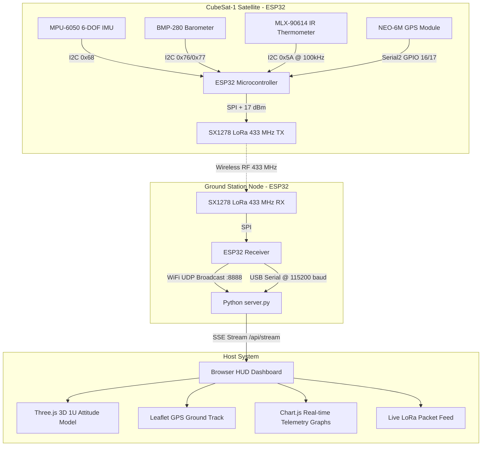

# CubeSat-1 Avionics, Ground Station & Mission Control Dashboard

An end-to-end 1U CubeSat avionics and ground segment telemetry platform powered by ESP32 microcontrollers, SX1278 LoRa transceivers (433 MHz), multi-sensor avionics, and a Python/Three.js Mission Control Web Dashboard with WiFi and USB Dual-Link support.

---

## 🛰️ System Architecture



---

## 📁 Repository Structure

```
.
├── cubesat/
│   └── cubesat.ino         # Satellite Flight Firmware (Sensors + LoRa TX)
├── ground_station/
│   └── ground_station.ino  # Ground Station Firmware (LoRa RX + WiFi UDP + USB Serial)
├── dashboard/
│   ├── server.py           # Backend: WiFi UDP & Serial Ingestion, HTTP & SSE Server
│   ├── index.html          # Frontend: Aerospace HUD layout
│   ├── style.css           # Styling: Deep-space cyberpunk HUD theme
│   └── app.js              # Client: Three.js 3D model, Leaflet map, Chart.js graphs
├── .gitignore
└── README.md
```

---

## 🔌 Hardware & Pinout Mapping

### ESP32 DevKit Wiring

| Module | Interface | ESP32 Pins | Description |
| :--- | :--- | :--- | :--- |
| **MPU-6050** | I2C | `SDA: 21`, `SCL: 22` | 6-DOF Accelerometer (±8g) & Gyroscope (±500°/s) |
| **BMP-280** | I2C | `SDA: 21`, `SCL: 22` | Barometric Pressure (hPa), Altitude (m), Temp (°C) |
| **MLX-90614** | I2C | `SDA: 21`, `SCL: 22` | Contactless Dual IR Thermometer (Ambient & Object Temp) |
| **NEO-6M GPS** | UART (Serial2) | `RX: 16`, `TX: 17` | Position (Lat, Lon, Alt, Satellites, Speed) |
| **SX1278 LoRa** | SPI | `SCK: 18`, `MISO: 19`, `MOSI: 23`, `NSS: 5`, `RST: 14`, `DIO0: 26` | 433 MHz, SF7, BW 125 kHz, CR 4/5, +17 dBm |

---

## 🚀 Quick Start Guide

### 1. Flash the CubeSat Firmware (via CLI)
```bash
arduino-cli compile --upload -p <PORT> --fqbn esp32:esp32:esp32 cubesat/cubesat
```

### 2. Flash the Ground Station Firmware (via CLI)
```bash
arduino-cli compile --upload -p <PORT> --fqbn esp32:esp32:esp32 cubesat/ground_station
```

### 3. Launch the Mission Control Server
```bash
cd cubesat/dashboard
python server.py
```

### 4. Open the Web Dashboard
Navigate to [http://localhost:8080](http://localhost:8080) in your web browser.

---

## 📶 WiFi Dual-Link Configuration

The Ground Station automatically supports dual-link communication:
- **Station Mode**: Connects to your configured local WiFi network.
- **Hotspot Fallback**: If no router is detected, it creates its own standalone WiFi Access Point:
  - **SSID**: `CubeSat-GS-WiFi`
  - **Password**: `cubesat1234`
  - **IP**: `192.168.4.1`
- Telemetry is broadcast over UDP port `8888` and simultaneously printed to USB Serial.

---

## 🛠️ Required Arduino Libraries
- `LoRa` by Sandeep Mistry
- `Adafruit MPU6050`
- `Adafruit BMP280 Library`
- `Adafruit MLX90614 Library`
- `TinyGPSPlus`

To install all dependencies with Arduino CLI:
```bash
arduino-cli lib install "LoRa" "Adafruit MPU6050" "Adafruit BMP280 Library" "Adafruit MLX90614 Library" "TinyGPSPlus"
```
